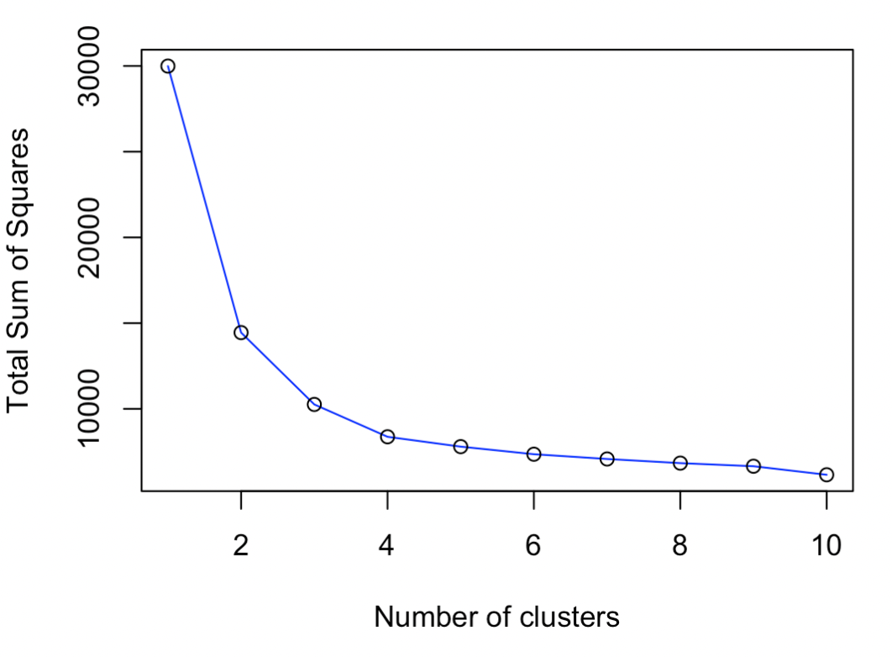

```{r setup, include=FALSE}
knitr::opts_chunk$set(echo = TRUE)
library(reticulate)
```

## 1. Serial version

### 1.1. k-means algorithm

El algoritmo k-means es un método de agrupamiento cuyo objetivo es dividir un conjunto de datos en un determinado número de grupos, donde cada observación del conjunto de datos pertenece al grupo cuyo valor medio es más cercano a dicha observación.

Para implementar este algoritmo hemos creado una función llamada "custom_kmeans" la cuál depende de tres parámetros, el dataset a estudiar, "X", el número de grupos o clusters en lo que se quiere dividir dicho dataset, "k", y la semilla que vamos a utilizar, "seed_value".

Lo primero que hacemos en nuestra función es determinar el número de filas y columnas que tiene nuestro dataset, "n" y "p", y a continuación creamos la matriz "assig_cluster" de dimensiones similares a nuestro dataset pero con una columna más en la cual especificaremos a que cluster pertenece cada uno de los puntos de nuestro dataset. El siguiente paso es crear un escalar lógico, "centroids_not_equal", al que designaremos por defecto el valor TRUE. Luego hemos creado el escalar numérico, "ite", con el objetivo de ir midiendo las interacciones que necesita llevar a cabo nuestra función. Seguidamente establecemos la semillas que vamos a utilizar, "seed_value", y creamos el vector "centroids_index" eligiendo aleatoriamente "k" números de entre las "n" observaciones de nuestro dataset. Una vez escogidos aleatoriamente los centroides recogemos en la matriz "centroids", de dimensiones "k" y "p", todas las componentes de dichos centroides.

El siguiente paso es crear un bucle "while" que mientras "centroids_not_equal" sea TRUE seguirá ejecutandose indefinidamente y dentro de este bucle creamos la matriz "distance_cluster" de dimensiones "n" y "k".

A continuación creamos otro bucle, dentro del primero, que recorre los valores de "k", dentro del cual rellenamos la matriz "distance_cluster" con la distancia en módulo de cada punto a cada uno de los centroides que hemos elegido antes aleatoriamente.

Cerramos el segundo bucle, creamos el vector "cluster" de longitud "n" y abrimos un tercer bucle dentro del bucle "while", el cual recorre los valores de "n". Dentro de este tercer bucle rellenamos el vector "cluster" con el número de cluster al cuál pertenece cada punto, es decir, el cluster al cual la distancia es menor. Para implementar este paso en Python hemos necesitado de una única linea de código, mientras que en R han sido necesarias algunas más y hacer uso de la función "if". Una vez rellenado "cluster" cerramos el tercer bucle, integramos estos datos en la matriz "assig_cluster" añadiendo a nuestro dataset "X" una columna más con los valores del vector "cluster", y creamos la matriz "new_centroids" de iguales dimesiones a la matriz "centroids".

Seguidamente creamos un cuarto bucle, también dentro del primero, que recorre de nuevo los valores de "k", mediante el cual rellenamos la matriz "new_centroids" con las coordenadas de los nuevos centroides, es decir, los centroides de los clusters que acabamos de crear. Dichas coordenadas las calculamos haciendo la media de cada variable en cada uno de los clusters asignados en el paso anterior. En este caso implementar el calculo de las coordenadas de los nuevos centroides en R requiere de un única línea de codigo, mientras que esta vez es en Python donde hemos necesitado de pasos intermedios para implementar este código.

Cerramos este cuarto bucle y utilizamos la función "if" para cambiar el valor de "centroids_not_equal" a FALSE si el vector "centroids" y el vector "new_centroids" son iguales y si esta condicion no ocurrieran con el comando "else" sobreescribimos el vector "centroids" con los valores del vector "new_centroids". Con estas cuatro líneas de código lo que conseguimos es comparar los centroides iniciales con los que hemos empezado el proceso con los que hemos creados tras asignar los clusters a los puntos, la idea es cada vez que ejecutamos este proceso los clusters sean cada vez más óptimos y más diferenciados entre si por lo que los centroides iniciales y finales irán cambiando, y el bucle se seguirá ejecutando hasta que demos con los clusters óptimos y los centroides de los que hemos partido sean los mismo que calculamos a traves de las medias de los cluster, ya que la disposición de los clusters, al haber alcanzado la forma óptima, permanece invariable. En este momento el vector lógico "centroids_not_equal" tomará el valor FALSE, el bucle inicial "while" dejará de ejecutarse y habremos obtenido nuestros clusters óptimos.

Antes de cerrar el bucle "while" hemos ido sumando 1 al escalar "ite" para poder ir midiendo en cuantas iteracciones se lleva a cabo el proceso. Por último, fuera del bucle pedimos a la función que nos devulva la matriz "assig_cluster", es decir, nuestro dataset orginal pero con una columna más donde se especifíca el cluster final al que pertenece cada punto.

### 1.2. Elbow graph

The elbow graph is a method used to determine the optimal number of clusters for a set of data. The resultant plot represents the sum of squared distances between points belonging to the same cluster over the total number of clusters.

Generally speaking, the graph has a steep slope at the beginning, due to the difference of distances between having one and two clusters is significant, and little by little the slope is getting less steep. Therefore, the larger the number of clusters the more softened the slope (smaller sum of squared errors to each centroid). We are looking for the elbow point, this means that we are searching for the point where there is a significant change in the slope. The associated total number of clusters of this point is the optimal number of groups for the given dataset.

We have implemented the `elbow_graph` function which helps us to create the elbow graph. This function depends on three parameters:

- The dataset we want to analyze, identified as `X`.
- The total number of cluster subject to study, identified as `total_k`.
- The seed value in order to reproduce the executions, identified as `seed_value`.

The first thing to do is to get the number of rows (_n_) and the number of columns (_p_). Later on, we initialize the vector `sum_sq_dist_total` resultant with the max number of clusters obtaining thanks to the parameter `total_k`. In this variable we will store for each number of clusters the total sum of squared distances in each centroid to the belonging points.

The next step is about executing the method k-means, which we have already implemented, for each number of clusters with the given data and the given seed value. The execution of this method produces a list which contains for each number of cluster the resultant matrix with the observations associated to each cluster. 

In R we have used the method `lapply` to execute this method as many times as the value of the parameter `total_k` is defined, meanwhile, in Python this functions is not available and we need to defined an explicit for-loop which iterates `total_k` times.

The final step is to calculate the sum of squared distances for each possible number of groups using the list of matrix obtained in the previous step. This will be the result of executing the method `elbow_graph`. Therefore, we have defined 1 for-loops, iterating for each possible number of clusters, and one nested loop which iterates from each cluster inside a specific possible number of total clusters. In this last loop we calculate each centroid per group applying the average function per columns and their distances to each point belonging to this group. The resultant is the sum of squared distances for the k-th number of groups.

Once the previous step is completed, we will have a list contained the sum of squared distances for each possible group. For instance, if we pick the element of the position 2 in the resultant list we will have the sum of squared distance associated to the result of executing the k-means with k equal to 2.


### 1.3. Cluster the data using the optimum value using k-means

Once the "custom_kmeans" function has been implemented, we proceed to apply it to our dataset. To do this we must make some previous modifications in our dataset, such as scaling the data so that some variables do not have more weight than others when measuring the distance and eliminate the categorical variables from the analysis since it is not possible to measure the distance between categories.

After making these changes, we have proceeded to apply the "custom_kmeans" function to our dataset for a value of "k" equal to 2, since, as we will see later when we represent the elbow graph, 2 is the optimal number of clusters for our dataset.

### 1.4. Measure time

Regarding the measurement of time, our results have been the following for the "custom_kmeans" function:

• Call the function k-means once for 500,000 rows in dataset in R: 5.407493 seconds

• Call the function k-means ten times for 500,000 rows in dataset in R: 213.03666 seconds

• Call the function k-means once for 500,000 rows in dataset in Python: 8.744184732437134 seconds

• Call the function k-means ten times for 500,000 rows in dataset in Python: 345.5383791923523 seconds

While for the "elbow_graph" function we have obtained the following times:

• Call the function elbow graph for 500,000 rows in dataset in R: 187.9113 seconds

• Call the function elbow graph for 500,000 rows in dataset in Python: 346.7162780761719 seconds

These results make sense since, given that for the "elbow_graph" function we have determined that the maximum number of clusters to study is 10, each time we execute "elbow_graph" with "total_k" = 10 it is being executed 10 times the "custom_kmeans" function, so the execution time of the "elbow_graph" function with "total_k" = 10 and the execution time of 10 times the "custom_kmeans" function are similar.

### 1.5. Plot the results of the elbow graph

In the following images we can see the elbow graph that is produced after applying the "elbow_graph" function to our dataset, in both R and Python:

```{r, echo=FALSE, out.width = '50%'}

knitr::include_graphics("elbowgraphPython.png")
```

In the graphs it can be seen that the elbow point, that is the point where the graph presents an "elbow" due to a significant change in slope, is associated with k = 2, so the optimal number of clusters for our dataset will be 2, as we mentioned before.

### 1.6. Plot the first 2 dimensions of the clusters

If we represent the first two dimensions of our dataset, "price" and "speed", for the two clusters created previously with the "custom_kmeans" function, we obtain the following graphs, in both R and Python:

```{r, echo=FALSE, out.width = '50%'}

knitr::include_graphics("first2dimensionsPython.png")
```

Despite the fact that two dimensions are too few to determine the clusters of a dataset of six variables, we can observe that when we graph these two variables together, two differentiated groups of data are formed that correspond practically 100% with the clusters that we have created, which gives us an idea that our clusters are probably an optimal solution for our dataset.

As we have said, two dimensions are not enough to appreciate the true nature of the clusters, so in the following image we have decided to plot the first three PCA of our dataset for our two clusters, in order to observe them better:

```{r, echo=FALSE, out.width = '100%'}
knitr::include_graphics("3firstpca.png")
```

In this graph we can observe two different groups of data that again correspond almost 100% with our clusters, which again leads us to the conclusion that we have created optimal clusters already suitable for our dataset.

### 1.7. Find the cluster with the highest average price and print it

After calculating the average price of both clusters, we have obtained that the cluster with the highest average price is cluster 1, as we had already been able to observe when we plotted the variables "price" and "speed" for our two clusters.

### 1.8. Print a heat map using the values of the clusters centroids

Next we have created a heat map using the values of the clusters centroids, in both R and Python:

```{r, echo=FALSE, out.width = '50%'}
knitr::include_graphics("heatmap.png")
knitr::include_graphics("heatmapPython.png")
```

In this graphs we can observe the dependency of belonging to each cluster depending on each of the variables of the dataset. Cluster 1 is characterized as having the highest average for "ram", "price", "speed", "cores" and "screen", while cluster 2 has the highest average for "hd".

## 2. Parallel implementation, multiprocessing

### 2.1. Write a parallel version of you program using multiprocessing

### 2.2. Measure the time and optimize the program to get the fastest version you can

### 2.3. Plot the first 2 dimensions of the clusters

### 2.4. Find the cluster with the highest average price and print it

### 2.5. Print a heat map using the values of the clusters centroids

## 3. Parallel implementation, threading

### 3.1. Write a parallel version of you program using threads

### 3.2. Measure the time and optimize the program to get the fastest version you can

### 3.3. Plot the first 2 dimensions of the clusters

### 3.4. Find the cluster with the highest average price and print it

### 3.5. Print a heat map using the values of the clusters centroids