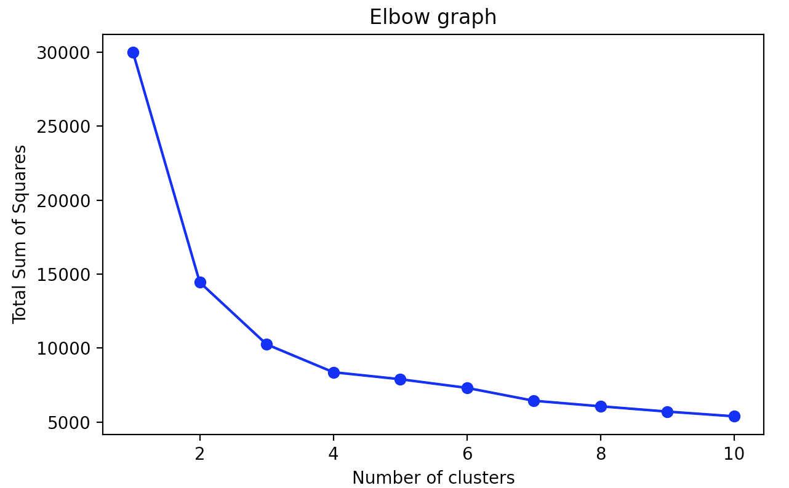
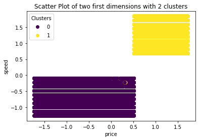

```{r setup, include=FALSE}
knitr::opts_chunk$set(echo = TRUE)
```

## 1. Serial version

### 1.1. Implement the k-means algorithm

The k-means algorithm is a clustering method whose objective is to divide a data set into a given number of groups, where each observation in the data set belongs to the group whose mean value is closest to that observation.

To implement this algorithm we have created a function called `custom_kmeans` which depends on three parameters:

- The dataset to study, `X`.
- The number of groups or clusters into which you want to divide our dataset, `k`.
- The seed value that we are going to use, `seed_value`.

The first thing we do in our function is determine the number of rows and columns that has our dataset, `n` and `p`, and then we initialize the `assig_cluster` matrix with dimensions similar to our dataset but with one more column in which we will specify to which cluster each of the points of our dataset belongs. The next step is to create a logical scalar, `centroids_not_equal`, which we initialize with the default value TRUE. Next we set the seed value we are going to use, `seed_value`, and create the `centroids_index` vector by randomly choosing `k` numbers from the `n` observations in our dataset. Once the centroids have been randomly chosen, we collect in the `centroids` matrix, of dimensions `k` rows and `p` columns, all of them.

The next step is to create a `while` loop that as long as the condition `centroids_not_equal` is equal to TRUE it will continue to execute itself indefinitely. Inside the while loop, the `distance_cluster` matrix is initialized with dimensions `n` rows and `k` columns. Next task is about to implement a for-loop that iterates through the values of `k`, inside which we fill the `distance_cluster` matrix with the euclidean distance from each point to each of the centroids that we have randomly chosen before.

We defined the second for-loop, inside the while loop, in order to create the `cluster` vector of length `n`. Within this second for, we fill the `cluster` vector with the cluster number to which each point belongs, that is, the cluster to which the distance is minimal. To implement this step in Python we have needed a single line of code, while in R we have needed a few more and make use of the `if` function. This is due to the possibility of having the same minimum distance, then an index is chosen randomly. Once `cluster` is filled in, we close the second for-loop and we merge this data into the `assig_cluster` matrix, containing our dataset `X` and one more column with the values of the `cluster` vector. and we create the `new_centroids` matrix of equal dimensions to the matrix `centroids`.

Next we create a third for-loop, also inside the while, that goes through the values of `k` again. This loop will determine the `new_centroids` matrix which contains the i-th new centroid of this iteration that is formed each of them by some values obtained by means of calculating the mean for each variable in each of the clusters assigned in the previous step. In this case, implementing the calculation of the coordinates of the new centroids in R requires a single line of code (using `colMeans`), while this time it is in Python where we have needed a few more lines (using `np.mean`).

We close this third for-loop and use the `if` function to change the value of the variable `centroids_not_equal` to false as long as the matrix `centroids` and the matrix `new_centroids` are the same, meaning that it contains the same data. If this condition does not occur, we overwrite the matrix `centroids` with the values of the matrix `new_centroids`. With these lines of code what we do is to compare the initial centroids with those that we have created after assigning the clusters to the points, the idea is that each time we execute this process the clusters are more and more optimal and more differentiated from each other, so the initial and final centroids will change, and the loop will continue executing itself until the algorithm finds the optimal clusters. At that moment the centroids from which we started the iteration must be the same as those calculated applying the means to the columns of each clusters, producing the exit of the `while` loop.

Last but not least, once the execution of the program is out of the while loop, the function returns the `assig_cluster` matrix, that is, our original dataset with one more column about the associated cluster for each observation.

### 1.2. Construct the elbow graph

The elbow graph is a method used to determine the optimal number of clusters for a set of data. The resultant plot represents the sum of squared distances between points belonging to the same cluster over the total number of clusters.

Generally speaking, the graph has a steep slope at the beginning, due to the difference of distances between having one and two clusters is significant, and little by little the slope is getting less steep. Therefore, the larger the number of clusters the more softened the slope (smaller sum of squared errors to each centroid). We are looking for the elbow point, this means that we are searching for the point where there is a significant change in the slope. The associated total number of clusters of this point is the optimal number of groups for the given dataset.

We have implemented the `elbow_graph` function which helps us to create the elbow graph. This function depends on three parameters:

- The dataset we want to analyze, identified as `X`.
- The total number of cluster subject to study, identified as `total_k`.
- The seed value in order to reproduce the executions, identified as `seed_value`.

The first thing to do is to get the number of rows `n` and the number of columns `p`. Later on, we initialize the vector `sum_sq_dist_total` resultant with the max number of clusters obtaining thanks to the parameter `total_k`. In this variable we will store for each number of clusters the total sum of squared distances in each centroid to the belonging points.

The next step is about executing the method k-means, which we have already implemented, for each number of clusters with the given data and the given seed value. The execution of this method produces a list which contains for each number of cluster the resultant matrix with the observations associated to each cluster. 

In R we have used the method `lapply` to execute this method as many times as the value of the parameter `total_k` is defined, meanwhile, in Python this functions is not available and we need to defined an explicit for-loop which iterates `total_k` times.

The final step is to calculate the sum of squared distances for each possible number of groups using the list of matrices obtained in the previous step (this will be the result of executing the method `elbow_graph`). Therefore, we have defined a for-loops, iterating for each possible number of clusters, and one nested loop which iterates over each cluster inside. In this last loop we calculate each centroid, applying the average function per columns, and their distances to each point belonging to this group. The resultant is the sum of squared distances for the k-th number of groups.

Once the previous step is completed, we will have a list contained the sum of squared distances for each possible group. For instance, if we pick the element of the position 2 in the resultant list we will have the sum of squared distance associated to the result of executing the k-means with k equal to 2.

### 1.3. Cluster the data using the optimum value using k-means

At this point, we have already implemented the serial versions of the `custom_kmeans` and the `elbow_graph` functions, then we proceed to process our dataset using them. To do this we have to make beforehand some tweaks in our dataset:

- Scaling the data, then all the variables do have the same weight in out dataset. There won't be some variables with more "power" than others when the distance is measured. 
- Dropping the categorical variables from the analysis since the algorithm is not working properly when categorical variables are presented. It is not possible to measure the distance between categories. 

After making these changes, we have proceeded to apply the `custom_kmeans` function to our dataset for a value of `k` equal to 2, since, as we will see later, when we represent the elbow graph, 2 is the optimal number of clusters for our dataset.

### 1.4. Measure time

Regarding the measurement of time, our results for a dataset of 500,000 rows have been shown that:

- For the `custom_kmeans` function:
  - In R
    - Call the function once took 5.407493 seconds
    - Call the function ten times took 213.03666 seconds
  - In Python:
    - Call the function once took 8.744184732437134 seconds
    - Call the function ten times took 345.5383791923523 seconds
- For the `elbow_graph` function:
  - In R
    - Call the function elbow graph took 187.9113 seconds
  - In Python
    - Call the function once took 346.7162780761719 seconds

These results make sense since we have assessed the time consumption when we call 10 times the `custom-kmeans` and the result is slightly smaller than the time used to execute the method `elbow_graph` which calls the function also k times.

### 1.5. Plot the results of the elbow graph

In the following images we can see the elbow graph that is produced after applying the function `elbow_graph` to our dataset, in both R and Python:

```{r, echo=FALSE, out.width = '50%'}
knitr::include_graphics("elbowgraph.png")

```

In the graphs above it can be seen that the elbow point, that is the point where the graph presents an "elbow" due to a significant change in slope, is associated with k = 2, so the optimal number of clusters for our dataset will be 2, as we mentioned before.

### 1.6. Plot the first 2 dimensions of the clusters

If we represent the first two dimensions of our dataset, "price" and "speed", for the two clusters created previously with the "custom_kmeans" function, we obtain the following graphs, in both R and Python:

```{r, echo=FALSE, out.width = '50%'}
knitr::include_graphics("first2dimensions.png")

```

Despite the fact that two dimensions are too few to determine the clusters of a dataset of six variables, we can observe that when we graph these two variables together, two differentiated groups of data are formed that correspond practically 100% with the clusters that we have created, which gives us an idea that our clusters are probably an optimal solution for our dataset.

As we have said, two dimensions are not enough to appreciate the true nature of the clusters, so in the following image we have decided to plot the first three PCA of our dataset for our two clusters, in order to observe them better:

```{r, echo=FALSE, out.width = '100%'}
knitr::include_graphics("3firstpca.png")
```

In this graph we can observe two different groups of data that again correspond almost 100% with our clusters, which again leads us to the conclusion that we have created optimal clusters already suitable for our dataset.

### 1.7. Find the cluster with the highest average price and print it

After calculating the average price of both clusters, we have obtained that the cluster with the highest average price is cluster 1, as we had already been able to observe when we plotted the variables "price" and "speed" for our two clusters.

### 1.8. Print a heat map using the values of the clusters centroids

Next we have created a heat map using the values of the clusters centroids, in both R and Python:

```{r, echo=FALSE, out.width = '50%'}


```

In this graphs we can observe the dependency of belonging to each cluster depending on each of the variables of the dataset. Cluster 1 is characterized as having the highest average for "ram", "price", "speed", "cores" and "screen", while cluster 2 has the highest average for "hd".

## 2. Parallel implementation, multiprocessing

To do this in R we will use mainly two libraries: `doParallel` and `foreach`.

The first one is a library that is oriented to the parallelization of problems where each thread performs its work independently, that is to say that they do not need to communicate in any way. The basic computational model that we should follow is:

1. Start M processes (threads).
2. Send the data required for each task to the threads.
3. Establish the task to be parallelized.
4. Wait for all threads to finish and get the results.
5. Close the processes (threads).

The second library, `foreach` allows to process loops in parallel and also needs the `doParallel` library to make the process in parallel using the registerDoParallel() function.  One of the benefits of this library is that you can execute commands using the `foreach()` function and do them in parallel using the `%dopar%` command. In addition, this `foreach()` function has a `.combine` argument that is used to specify the type of output argument needed (c: vector, rbind: matrix, list:list, data.frame: output of type data.frame...).

As we know there are two ways to perform parallelism in R: 

- via sockets: it creates a copy of the current R environment, in each core and performs the indicated operation, this has no major implementation difficulty but is not available for Windows.

- via forking: is more general and requires a little more work to implement, here a cluster is created on the same machine (it can also be used to create a cluster with more machines) and a new version of R is launched to each core, since it is a new environment, it must send to the threads each object it needs to perform its task, including the invocation of libraries, if necessary. This approach is available on any operating system (including Windows).

We will see that if a script takes a few seconds, parallelization is probably not worth it as we will see in our case. 


### 2.1. Write a parallel version of you program using multiprocessing

Our function in this case using multiprocessing will be called `custom_kmeans_mp` which, as we said before, will be in charge of dividing our dataset into a certain number of groups, where each observation of the dataset belongs to the group whose average value is closest to that observation. 

The first thing we will do is to detect the number of logical cores in the machine using `detectCores()`. We have selected half of the cores since this is usually what works best to keep the operating system and the rest of the tasks of our machine running normally. To this quantity we will assign the name `num_cores`.

Next, we will assign a new variable `par_cluster` to create the cluster, where we specify the number of threads that we are going to use by means of the function makeCluster().

In what follows, we use the `foreach` library, which, as we said before, allows us to process loops in parallel. 

That is, we will go from calculating the distance in modulus from each point to each of the centroids (previously chosen randomly) using a loop to perform it in parallel using the `foreach()` function and we will choose the minimum distance, now using `parApply()` (function are similar to those known from the base of R that takes care of all the heavy work in the parelization) instead of performing a loop going through each of the calculated distances.

We then calculate the cluster number to which each point belongs, i.e. the cluster to which the distance is smaller and store it in the variable `cluster` using the `max.col()` function. As in the serial case, we add a column to our dataset (variable `assig_cluster`) where each point is assigned the cluster for which its distance to the respective centroid is the minimum.

Another modification would be to calculate the new centroids instead of using an iterative process, also using the `foreach()` function.

Finally we will use the `autostopCluster()` function which must be executed to close all R environments created in the threads (if this is not done, our subsequent procedures may present problems).


On the other hand to perform the elbow graph using multiprocessing we build the function `elbow_graph_mp` and which differs from the previous function performed serially in the following aspects:

- As in the case of the previous function, we will first detect the number of logical cores in the machine using `detectCores()`. We have selected half of the cores and to this amount we will assign the name `num_cores`.

- Then we apply to our dataset the function `custom_kmeans` for each of the values of `total_k` (column corresponding to the cluster assigned to each point). To apply this function in parallel we will use the function `parLapply` in R, while in Python....

- The iterative process performed to obtain `sum_sq_dist_total` (squared distances between each point and the centroid of the cluster associated to that point for each of the cluster values we want to study) in our serial version will be replaced by the `foreach()` function which will allow us to determine the optimal number of clusters for our dataset by command `%dopar%` which performs the same steps as the `elbow_graph` function but in parallel.

- Finally we will use the `autostopCluster()` function which must be executed to close all the R environments created in the threads.

### 2.2. Measure the time and optimize the program to get the fastest version you can

Regarding the measurement of time, our results for a dataset of 500,000 rows have been shown that:

- For the `custom_kmeans_md` function:
  - In R
    - Call the function once took 13.29007 seconds
    - Call the function ten times took 7.812078 minutes
  - In Python:
    - Call the function once took  seconds
    - Call the function ten times took  seconds
- For the `elbow_graph` function:
  - In R
    - Call the function elbow graph took 1.215241 minutes
  - In Python
    - Call the function once took  seconds

Some interesting conclusions can be drawn from these results:

- In R

  - When we call the function `custom_kmeans_md` once and check the time      consumption, the time difference of 13.29007 secs for 500000 rows in      dataset. There is no improvement as the serial version took 5.407493      secs. It happens often that parallelization for quick tasks is not        worthy.

  - On the other hand if we call the serial function `custom_kmeans` ten      times and check the time consumption, it is a great improvement as it     took 3.550611 minutes for the serial version of `lapply`.
  
  - Finally, if we call the multiprocessing function, `custom_kmeans_md`,     ten times and check the time consumption we will can see that the time     difference is 7.812078 minutes for 500000 rows in dataset.
    This version is even much worse than the serial one. This could happen     because in parallel programming is not recommended to apply in two        levels (`parLapply` is one level and the function itself the other).
    
  - With regard to the function of the elbow graph, `elbow_graph`, we can     say that it considerably reduces the time to process the data compared     with the serial version which took 3.598459 minutes to process the        same data.


- In Python


### 2.3. Plot the first 2 dimensions of the clusters

### 2.4. Find the cluster with the highest average price and print it

### 2.5. Print a heat map using the values of the clusters centroids

These parts correspond with the same code described in the serial part but with the data obtained from the multiprocessing version. They shows the same behavior, checked with a dataset of 500000 rows. The code files contains all the logic to generate these graphs.

## 3. Parallel implementation, threading

### 3.1. Write a parallel version of you program using threads

In this section we have implemented two different approaches depending on the programming language we are working with. 

First we are going to describe the case when the programming language is R which doesn't allow to use a proper thread implementation, then what we are going to use are clusters of type _fork_. This type of parallelization copies the entire current version of R and moves it to a new core. They are usually faster than sockets, the approach described in the previous point about multiprocessing. Nevertheless they are only available in POSIX systems (MacOS, Linux and so on), then it is not possible to run them on Windows. The way we have implemented this approach is very similar that the way we have implemented the multiprocessing but in this case we have to explicitly indicate that we want forking clusters.

The next technique we are going to shown is the threading approach that Python provides. There are two modules that support the usage of threads: `Threading` and `Thread`. Using them, we can create and manage threads that are by definition non-deterministic and always performed by the operating system, allowing to the programmer to explicitly defining them. The bad thing is that the performance is not very optimized as we will see this in the next point.

### 3.2. Measure the time and optimize the program to get the fastest version you can

Regarding the measurement of time, our results for a dataset of 500,000 rows have been shown that:

- For the `custom_kmeans_th` function:
  - In R
    - Call the function once took 11.13016 secs
    - Call the function ten times (`mclapply` -forking-) took 1.151806 mins
  - In Python:
    - Call the function once took 125.03917098045349 seconds
- For the `elbow_graph_th` function:
  - In R
    - Call the function elbow graph took 1.155695 mins
  - In Python
    - Call the function once took 338.7781488895416 seconds
    
As we could expect, we have seen that the times have considerably reduced when the forking approach is used in R. On the other hand, the use of threads in just one core in Python doesn't produce a good performance, being the times consumption much more worse. 

### 3.3. Plot the first 2 dimensions of the clusters

### 3.4. Find the cluster with the highest average price and print it

### 3.5. Print a heat map using the values of the clusters centroids

These parts correspond with the same code described in the serial part but with the data obtained from the threading version. They shows the same behavior, checked with a dataset of 500,000 rows. The code files contains all the logic to generate these graphs.

