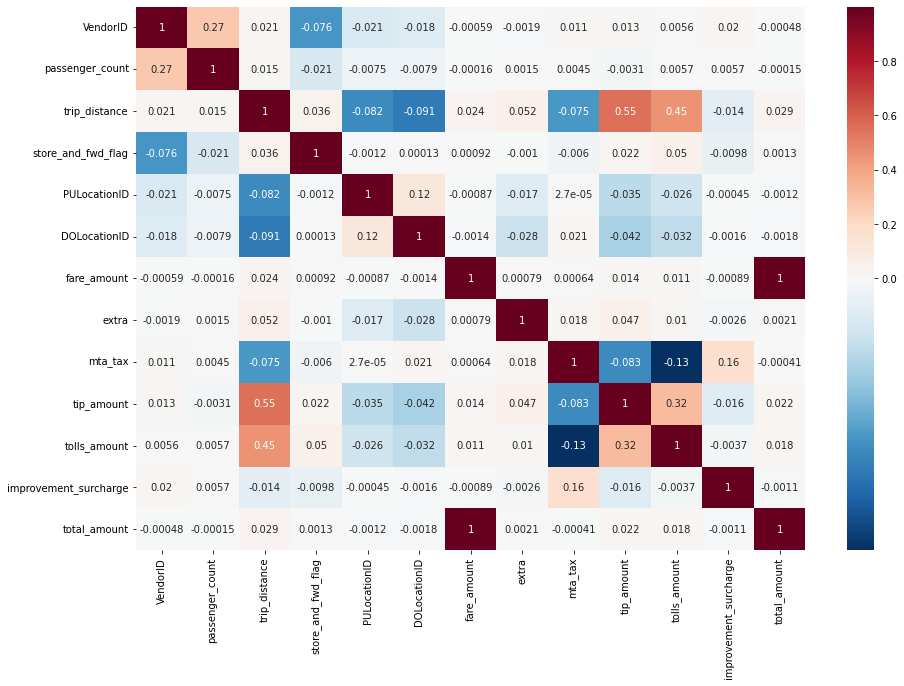
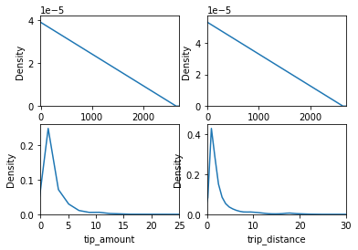
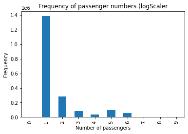
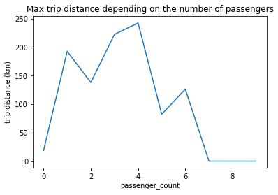

```{r setup, include=FALSE}
knitr::opts_chunk$set(echo = TRUE)
```

\newpage

# Introduction: Goal and description of our dataset

The aim of this assignment's part is to carry out the studies we have considered necessary on the data provided by the (NYC Government). 

This dataset is about the taxi trips in this city recorded by the yellow cabs and the green ones (only allowed to operate in outer boroughs except Manhattan and the main airports).

These are the variables which are presented in the dataset:

- `VendorID`: a code indicating an id of the provider that generated the record.
- `xtpep_pickup_datetime`: date and time when the meter was engaged.
- `tpep_dropoff_datetime`: date and time when the meter was disengaged.
- `passenger_count`: number of passengers in the vehicle (this is a value defined by the driver).
- `trip_distance`: elapsed trip distance in miles reported by the taximeter.
- `rateCodeID`: final rate code (1=Standard rate, 2=JFK, 3=Newark, 4=Nassau or Westchester, 5=Negotiated fare and 6=Group ride).
- `store_and_fwd_flag`: a flag which indicates if the trip was recorded in the car before sending to the server due to bad connection in that moment (Y (store and forward) or N).
- `PULocationID`: taxi Zone in which the taximeter was engaged.
- `DOLocationID`: taxi Zone in which the taximeter was disengaged.
- `payment_type`: numeric code signifying how the passenger paid for the trip (1=Credit card, 2=Cash, 3=No charge, 4=Dispute, 5=Unknown and 6=Voided trip).
- `fare_amount`: time-and-distance fare calculated by the meter.
- `extra`: miscellaneous extras and surcharges.
- `mta_tax`: $0.50 MTA tax that is automatically triggered based on the metered rate in use.
- `tip_amount`: field is automatically populated for credit card tips (cash tips are not included)
- `tolls_amount`: total amount of all tolls paid in trip. 
- `improvement_surcharge`: $0.30 improvement surcharge assessed trips at the flag drop.
- `total_amount`: total amount charged to passengers (does not include cash tips).

\newpage

# Part I: Pre-processing and some interesting aspects of our data

In this part, we will use Python to create a serial programme to perform a descriptive analysis of our data, as well as some aspects that we consider necessary or of interest to obtain relevant information about our data. 

The first thing we have done is to import all those Python libraries that we needed to make the program as well as read our data using `read_csv` and then concatenate them using `concat` from Panda to form a single dataset.

Next we have created three functions that will help us to better understand our dataset: `get_payment_type`, `get_rate_code_id` and `miles_to_km`. The first two functions rename the levels of the categorical variables `payment_id` and `rate_code_id` respectively. On the other hand, the third function rescales the `trip_distance` variable to km.

To finish this part of the preprocessing, we have made, depending on the column, the necessary changes according to the type of variable in our dataset. For example: we have considered `payment_id` and `rate_code_id` as categorical variables, `store_and_fwd_flag` as binary and `tpep_pickup_datetime` and `tpep_dropoff_datetime` as datetime variables.

Once we have "made our variables good", we check that there are no missing values. Although there are no missing values, there are values of some variables that do not make sense, for example: all those negative values of variables that are measured in distance and money. We correct the previous problem by replacing these values by the mean of the corresponding variable.

We are now ready to work with our data set. First we will calculate the correlation of our variables using the `corr()` function and we have observed that there are linear relationship between the following pairs of variables:

```{r, echo=FALSE, out.width = '50%'}

```

- There is a perfect positive linear correlation between `fare_amount` and `total_amount` (they could contain the same values).
- There is a positive correlation (0.55) between `trip_distance` and `tip_amount`.
- There is a positive correlation (0.45) between `trip_distance` and `tolls_amount`.
- There is a positive correlation (0.33) between `mta_tax` and `improvement_surcharge`. 
- There is a positive correlation (0.32) between `tip_amount` and `tolls_amount`.

```{r, echo=FALSE, out.width = '50%'}

```

In the plots above, we can see that the distribution of the `tip_amount` and the `trip_distance` are right skewed, having concentrated their values to the left (approximately, between 0 and 10). Moreover, as we said before in the correlation plot, it looks like the `total_amount` and the `fare_amount` are the same variables. Then, we are going to proceed to delete one of them, in this case the chosen variables is `fare_amount`. Then, the total amount (in dolars) of the trip is between 0 euros and, approximately, 2700.

To find out more about our data, we have studied four main aspects: 

1. Journey type analysis. 
2. Average distance during each part of the day. 
3. Frequency of the number of passengers.
4. Max trip distance based on the number of passengers.

## Journey type analysis

We have found out which is the most used payment method on the trip with the longest average distance by calculating the maximum of the averages of the variable `trip_distance` and then calculating the payment method (variable `get_payment_type`) of that trip.

Finally we have obtained that the payment method of the trip with the longest average distance is credit card, which makes sense: a long trip implies a high amount of money, and most people do not have that much loose cash.

## Average distance during each part of the day

In this case, what we want to know is the average distance according to the part of the day: morning, afternoon, evening, night and early morning.

For this we have created a new variable `pu_hour` that corresponds to the variable `tpep_pickup_datetime` in hours, then we have divided this new variable into five groups: 

- Morning: if the variable `pu_hour` is between 7.00 a.m. and 12.00 a.m. (not included).
- Afternoon: f the variable `pu_hour` is between 12.00 a.m. and 4.00 p.m. (not included).
- Evening: if the variable `pu_hour` is between 4.00 p.m. and 6.00 p.m. (not included).
- Night: if the variable `pu_hour` is between 6.00 p.m. and 11.00 p.m. (both included).
- Latenight: if the variable `pu_hour` is between 12.00 p.m. and 7.00 a.m. (not included).

We have then calculated the mean of the variable `trip_distance` for each of these groups and we have seen that distances are longer at night, this may be due to the fact that in many cities there is no public transport or the number of public transport services is considerably reduced during this time, so people choose to travel by taxi. Night travel influences the distance.

## Frequency of the number of passengers

In this case, we want to know how many passengers in a trip are the most frequent.

For this task we have drawn a bar diagram of the number of passengers (variable `passenger_count`) which can be seen below.

```{r, echo=FALSE, out.width = '50%'}

```

It is clear that the typical scenario is a trip with just one passenger.

## Max trip distance based on the number of passengers

In this case, we want to know the maximum distance of a trip based on the number of passengers.

To do this we first used the function `miles_to_km` to convert our variable `trip_distance` to km, then we calculated the average of this variable according to the number of passengers (variable `passenger_count`) and finally we plotted passenger_count vs `trip_distance` and we can see the behaviour of this distribution.

```{r, echo=FALSE, out.width = '50%'}

```

In the plot above we can see that the largest trip distance (almost 250km) was made by four passengers.

\newpage

# Part II: Parallel version using PySpark

## PySpark environment setup

To work with our dataset in the parallel case we have made use of `StructType` through which we have defined the name and datatype of each variable and later we have collected all the data in the Schema `cab_trips`.

Next, we are going to use the method `cache` to do the optimization of the dataset in order to do the processing faster. Later on, we are going to generate a random sample of the ten percent of the rows without replacemant and select the two first rows.

In this step, we can observe that pyspark implements lazy operations, that means that nothing is executed until some commands such as `take`, `collect` or `show` are executed.

## Journey type analysis

Now, we want to know more information about the journey data, what's the payment method used on the longest trip in average? To get that information we apply `group by` to `cab_trips`, where the column to be grouped is `payment_type`, the column that gets aggregated with aggregate operations is `trip_distance`, the aggregate function is `mean`, the column to be given from old column is `avg_trip_distance`, `col` is the function to specify the column on filter, and the condition is `desc`.

The output of this function shows that the payment with the highest average distance is payment 1, with and average 2.9959558764164433.

## Average distance during each part of the day

To determine average distance during each part of the day we have done something similar that in the serial case, with the difference that instead of creating a new variable `pu_hour`, we have created a new column `hour`, that he have divided in the same five groups. The results obtained are similar that in the serial case but in miles instead of km.

## Frequency of the number of passenger

To determine the frequency of the number of passengers we apply `group by` to `cab_trips`, where the column to be grouped is `passenger_count`, the column that gets aggregated with aggregate operations is `passenger_count` too, the aggregate function is `count`, the column to be given from old column is `counts_passenger`, `col` is the function to specify the column on filter, and the condition is `desc`.

If we plot the bar diagram of `passenger_count` vs. `counts_passenger` we obtain the same graph as in the serial version.

## Max trip distance based on the number of passengers

To determine the Max trip distance based on the number of passengers we apply `group by` to `cab_trips`, where the column to be grouped is `passenger_count`, the column that gets aggregated with aggregate operations is `trip_distance`, the aggregate function is `max`, the column to be given from old column is `max_trip_distance`, `col` is the function to specify the column on filter, and and the condition is `asc`.

If we plot `passenger_count` vs. `max_trip_distance` we obtain the same graph as in the serial version.